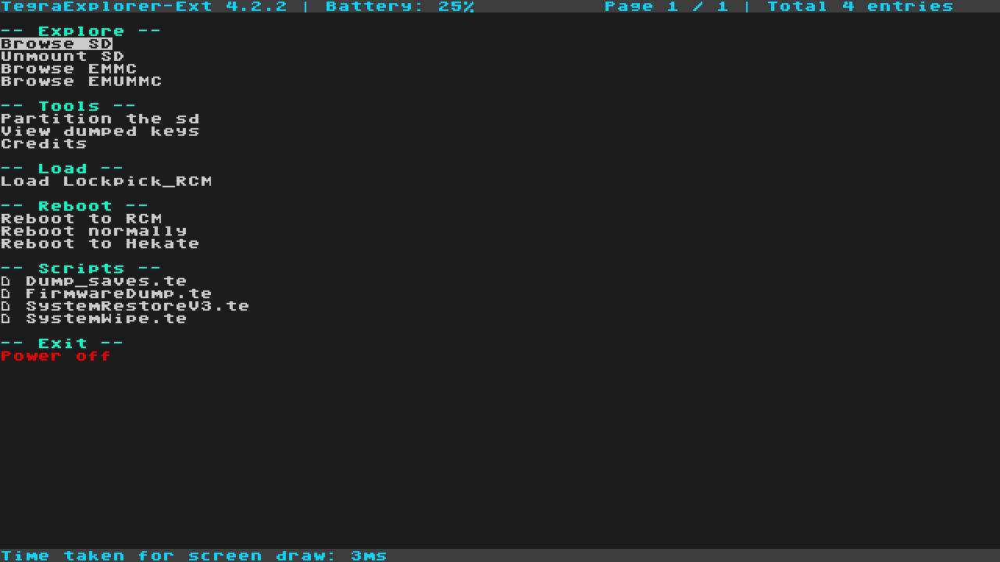

# TegraExplorer

  

A payload-based file explorer for your switch!

## Usage
1. Get your favorite payload injector
2. Inject TegraExplorer as a payload

Navigate around the menus using the joycons.
- A: Select
- B: Back
- Left Joystick up/down (Dpad or joystick): navigate menus up/down
- Right Joystick up/down: fast menu navigation up/down
- Capture (Minerva only): Take a screenshot
- L3/R3 (Press joysticks in): Recalibrate centerpoint

If you do not have your joycons connected:
- Power -> A
- Vol+ -> Left Joystick up
- Vol- -> Left Joystick down

## Functions
- Navigate the SD card
- Navigate the System partition of your sysmmc and emummc
- Interact with files
	- Deleting, copying, renaming and moving files
	- Launching payloads files
	- Viewing the hex data of a file
	- Launching special [TegraScript](https://github.com/suchmememanyskill/TegraScript) files
	- Renaming files
- Interacting with folders
	- Deleting, copying or renaming folders
	- Creating folders
- Dumping your current firmware to sd
- Formatting the sd card

*and more*

## Support

For general CFW support, go to the [Nintendo Homebrew](https://discord.gg/C29hYvh) discord

## Changes in This Fork

This is a modified version of TegraExplorer with custom enhancements:

### Script Modifications
- **SystemWipe.te**: Enhanced UI with flashing border animation, detailed warning screen, improved safety checks
- **FirmwareDump.te**: Streamlined workflow with cleaner user interaction flow

### Repository Independence
- Completely separated from upstream repository
- All embedded scripts regenerated from local source
- No automatic syncing with original project

## Credits

Original project by suchmememanyskill.

Based on [Lockpick_RCM](https://github.com/shchmue/Lockpick_RCM), and thus also based on [Hekate](https://github.com/CTCaer/hekate)

Awesome people who helped with this project:
- [shchmue](https://github.com/shchmue)
- [maddiethecafebabe](https://github.com/maddiethecafebabe/)
- [bleck9999](https://github.com/bleck9999)

Other awesome people:
- PhazonicRidley
- Dax
- Huhen
- Exelix
- Emmo
- Gengar
- Einso
- JeffV

## Screenshots

